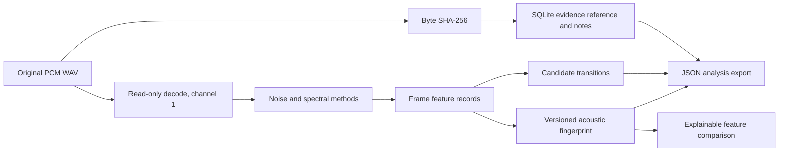

# Engineering and method specifications

## Purpose and boundary

This beta is a desktop research workstation for inspecting acoustic changes and comparing measurable environmental descriptors. The four analysis questions in the project directive remain separate: scene type classification, acoustic comparison, known-location reference comparison, and continuity/authenticity examination. Only descriptive comparison and candidate transition detection are implemented. No physical-location attribution, authenticity finding, or calibrated statistical conclusion is produced.

## Architecture and data flow

## Component contracts

### Audio input

`load_wav(path) -> AudioData` accepts uncompressed PCM WAV with 8, 16, 24, or 32-bit integer samples and a positive sample rate. It converts integer samples to float64 in approximately [-1, 1], selects channel 1, and retains the original channel count and sample width as metadata. It rejects corrupt, compressed, empty, partial-frame, and unsupported-width files. The source is not modified. Channel 1 is an explicit beta limitation; all-channel and spatial analysis are future work.

### Integrity

`sha256_file(path)` hashes exact file bytes in 1 MiB chunks. This is the evidence digest. It is independent of decoding, analysis, and the fingerprint hash. A changed file path or digest creates a distinct evidence record. The beta does not provide a complete legal chain-of-custody system or digitally signed manifests.

### Independent methods

- `methods/noise.py`: frame RMS in dBFS and p10/median/p90 frame-level distributions. Values are digital full-scale measures, not calibrated acoustic SPL or isolated background noise; the lower percentile is not labelled a measured noise floor.
- `methods/spectral.py`: Hann-windowed real FFT; centroid and flatness plus mean power in fixed bands 0–125, 125–250, 250–500, 500–1000, 1000–2000, and 2000–4000 Hz. Bands above Nyquist are empty. Record sample rate and window duration with results.
- `methods/reverberation.py`: experimental reverse-integrated energy curve; regression from -5 to -25 dB and RT60 extrapolation `-60 / slope`. It must be run only on a suitable measured impulse response. No calibration, geometry, repeatability, or ISO compliance is asserted.
- `transitions.py`: adjacent frame changes in RMS, centroid, flatness, and band powers. Per-feature deltas are stored with each event. The aggregate threshold is heuristic; a candidate means review this timestamp, not an established room boundary.

### Fingerprint and comparison

Fingerprint schema `aefp-1` contains median spectral/noise features, band powers, sample rate, duration, and frame count. Canonical JSON uses sorted keys, compact separators, and finite numbers. SHA-256 over that canonical feature record identifies this fingerprint version. Algorithm or serialization changes require a new version.

The comparison returns named raw differences and a bounded descriptive score derived from normalized feature deltas. Normalizers are implementation constants, not calibrated forensic scales. The interface must preserve raw deltas and state that the score is neither a probability nor a likelihood ratio. Version mismatches are rejected.

### Evidence notes and export

SQLite stores evidence path, byte SHA-256, first-seen UTC timestamp, and notes containing evidence ID, audio timestamp, title, body, and creation UTC timestamp. A note timestamp must be nonnegative and no later than the loaded duration in the UI. JSON export includes schema and algorithm versions, source hash, frame records, fingerprint, candidate transitions, notes, and limitations. Export is not signed in this beta.

## User interface

The Analysis view exposes evidence hash, acoustic fingerprint hash, candidate timeline markers, transition deltas, and median feature values. Compare opens a second WAV and reports a transparent per-feature delta table alongside the clearly labeled score. Examiner Notes require an audio timestamp and bind to the current evidence digest. JSON export is explicit and does not replace the original. Keyboard traversal uses native Tk controls; accessibility review remains outstanding.

## Error handling and security

- Invalid or unsupported files show an error and do not replace the last successful analysis.
- Evidence content is read-only; the application writes only its own SQLite database and an export path explicitly chosen by the user.
- Analysis file reads are streamed for hashing. WAV decode memory scales with full decoded duration in this beta.
- JSON serialization rejects non-finite numbers.
- Local database access follows the current user's filesystem permissions. Encryption, multi-user access controls, signed manifests, and secure deletion are not provided.

## Integration and extension rules

Each scientific method belongs in its own module, has a documented input/output contract, independent tests, a validation record, and visible result values. Modules consume decoded data and do not rewrite evidence. Reuse in another application is limited to `integrity.py`, `audio_io.py`, `methods/*`, `features.py`, `fingerprint.py`, `comparison.py`, and `transitions.py`; preserve each module's version and caveats when migrating.

